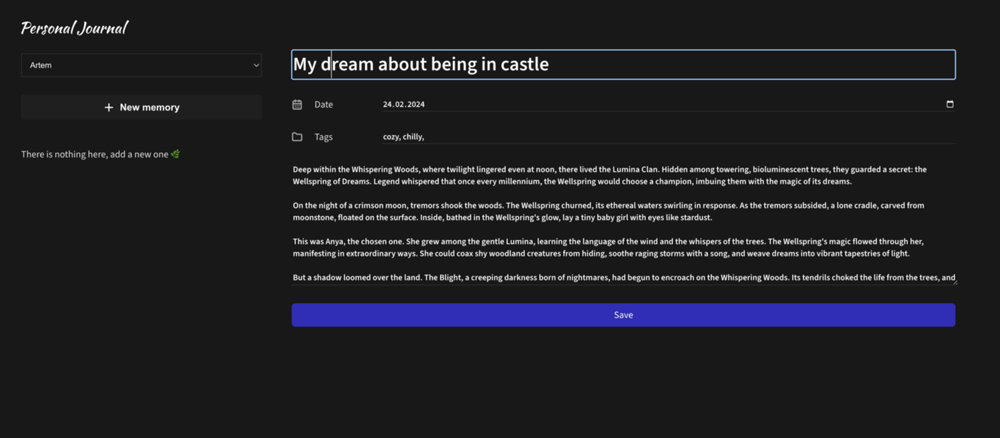
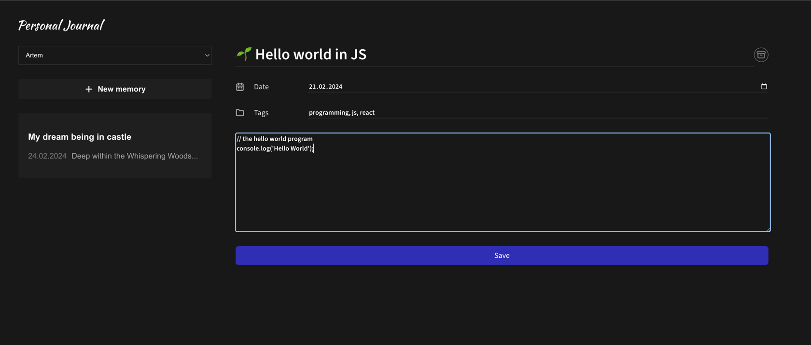

## Personal Journal - React Application

**Description:**

This is a personal journal application built with React and Vite. It allows you to write, edit, and organize your journal entries with a simple and intuitive interface.

**Technology Stack:**

* Frontend: React, Vite
* Linting: ESLint
* Library: classnames

**Installation:**

1. Clone the repository:

```bash
git clone https://github.com/JessieCasey/personal-journal.git
```

2. Install dependencies:

```bash
npm install
```

3. Start the development server:

```bash
npm run dev
```

4. Open http://localhost:5173 in your browser.

**Screenshots**




